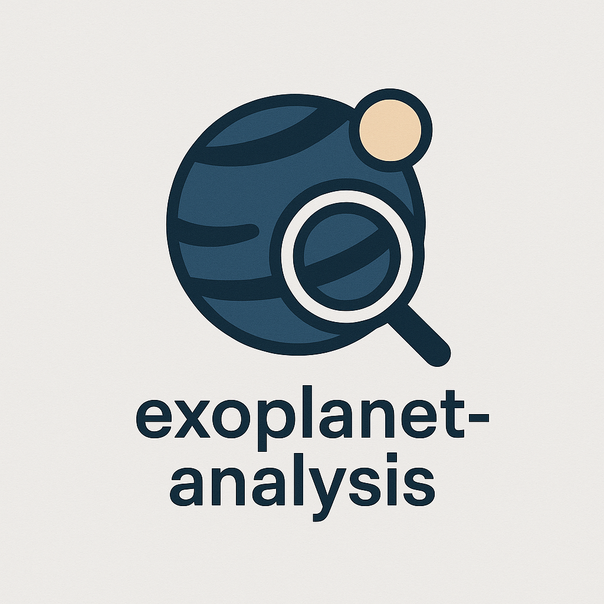

# Exoplanet analysis



<br /><br />

This project aims to use [Nasa's Exoplanet Data](https://exoplanetarchive.ipac.caltech.edu/cgi-bin/TblView/nph-tblView?app=ExoTbls&config=PS) and anylizes it to make useful comparisons

# Getting Started

The project uses *Streamlit* to display the data. It's currently deployed for free on [streamlit cloud](https://exoplanet-analysis.streamlit.app/). Though it takes quite a while to load in the data, 
hosting it yourself locally might be a good idea.

# Hosting it yourself

## Setting up the repository
Git clone the repository:

```git clone https://github.com/danizdes/exoplanet-analysis```

When you're in the repository, it's advisable to create a *virtual environment*

```python -m venv env```

Now activate the virtual environment:

on Linux/Macos:

```source env/vin/activate```

on Windows:

```env\Scripts\activate```

Once you've activated the virtual environment, install all the required python packages:

```pip install -r requirements.txt```

## Analysing the data
Firstly, head over [Here](https://exoplanetarchive.ipac.caltech.edu/cgi-bin/TblView/nph-tblView?app=ExoTbls&config=PS) and download the table in csv format. 

rename it to ```planetory_systems.csv``` and move it to the root folder if necessary. Replace it with the existing file.

Now run all the code blocks from each notebook in this order

* ```analysis.ipynb```
* ```exoplanet_discoveries_by_year.ipynb```
* ```planet_mass_vs_radius.ipynb```
* ```star_vs_planet_temperature.ipynb```
* ```planets_radius_vs_orbper.ipynb```

## Running the site

Now simply run this in the terminal:

```streamlit run streamlit/Introduction.py```

*PSS*: Ensure you're running this from the root folder! Running it by changing the directory to the streamlit folder wont work!
 
And there you go! You should be redirected to you're own locally 
self-hosted  version of this app!